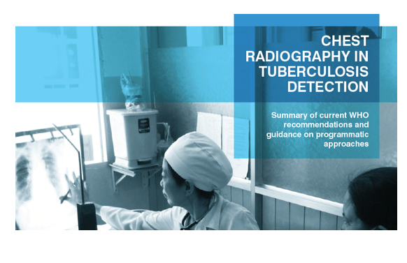
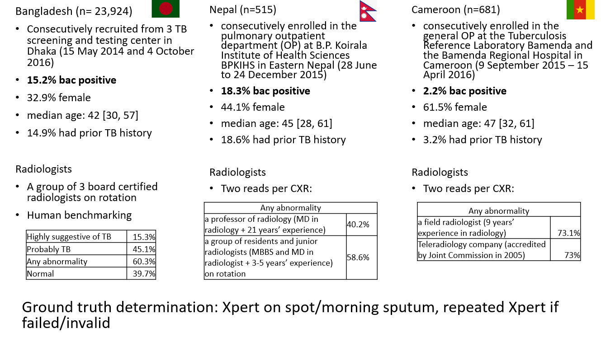
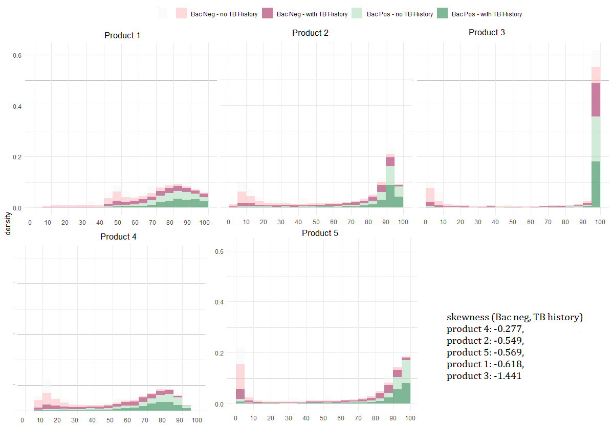
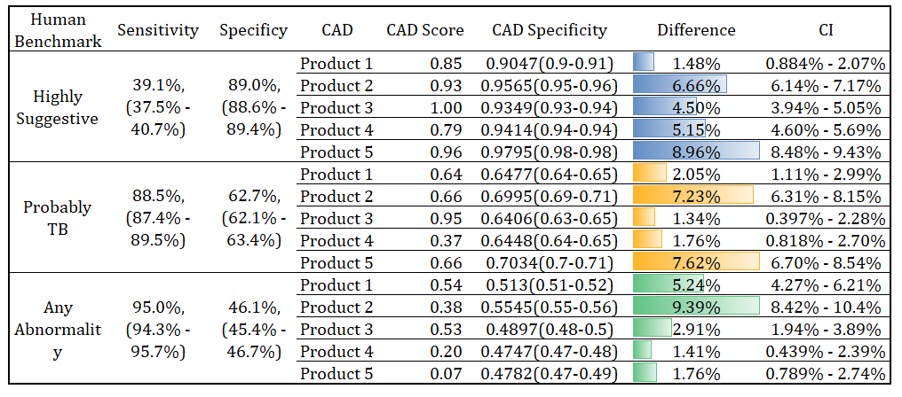
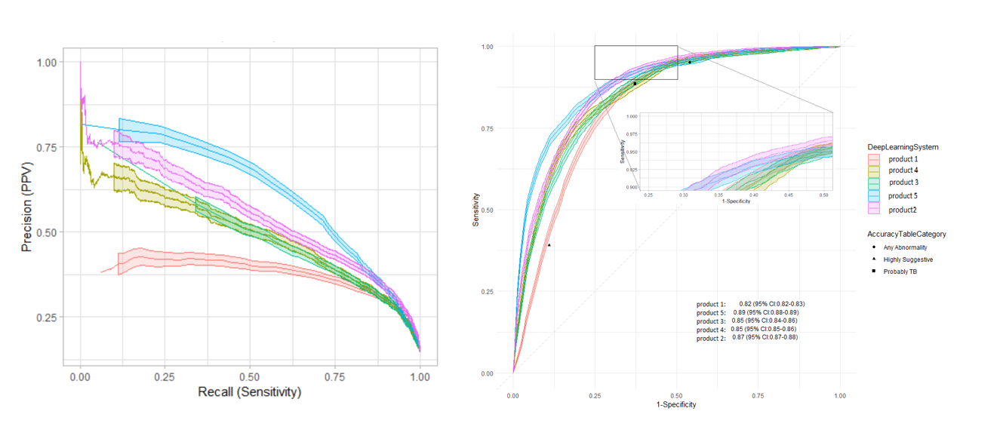
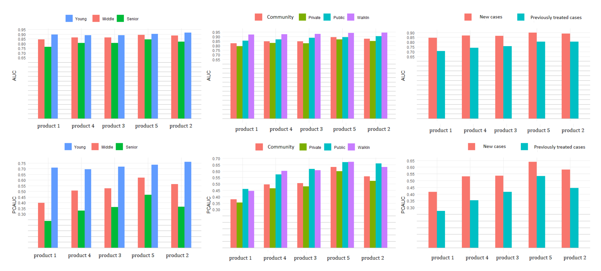
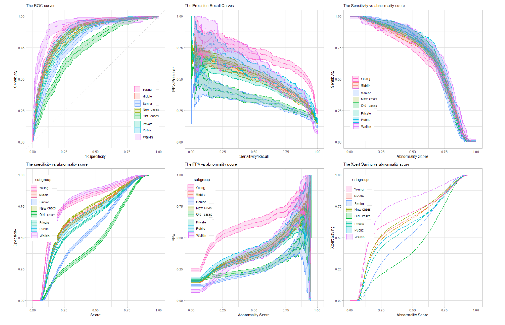
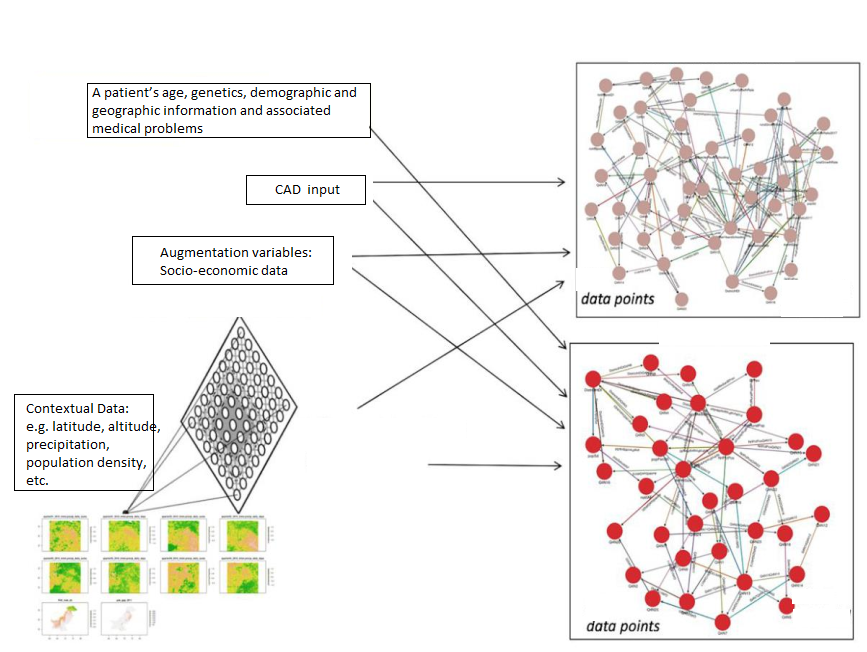

```{r setup, include=FALSE}
knitr::opts_chunk$set(fig.width=15, fig.height=12, echo=FALSE, warning=FALSE, message=FALSE)
```


## AI in Healthcare
AI is not a new concept - first coined in 1956 by John McCarthy, AI involves machines that can perform tasks that are characteristic of human intelligence. 

Since then, AI has been in finance, insurance, marketing, etc, but has made few contributions to healthcare until recently. 

ImageNet 2012 Challenge's breakthrough significantly improved performance of computer automated detection (CAD) technology to analyse large medical images.

Visual detection tools powered by AI such as CAD has a huge potential in medical practices.  


## Challenge - Tuberculosis detection 
4 million people with TB are not diagnosed and reported annually, but can be detected by CXR screening. 

    Identify more people to be tested (asymptomatic individuals).
    Cut down on the number of expensive Xpert tests that are needed - especially 
    when used in active / systematic case finding.

Several scientific articles found that trained radiologists are not available in places where TB is more prevalent.  

CAD technology can identify TB-related abnormalities to triage people for testing. 

{width=200px}

## Separating Reality from Hype

Several CAD solutions are available for TB, however, often the marketed accuracy is done on the same data superset for training, testing and validation and cannot be generalized to other setting. 

All CAD solutions are limited as visual tools. But when we embed clinical relevant data along with CAD reading into predictive algorithms, computers can extract information and apply it to recommend the most appropriate differential diagnosis. 


We conducted multi-site evaluation of the 5 CAD according the Standards for Reporting of Diagnostic Accuracy (STARD) Initiative on design and conduct of diagnostic accuracy evaluation.


## Evaluation Setup

<div class="black">
{width=1000px}

<center>
</center>


</div>

## Density Plots {.smaller}

<!-- {width=900px}  -->
  
{width=900px}

</div>

<center>
</center>


## Human vs Machine{.smaller}

<center>
{width=1000px}


</center>


## Which product to choose? 

{width=1000px}
  
## Which product to choose in reality?
{width=1000px}

## Predictive Algorithms 
{width=1000px}

## Predictive Algorithms 
{width=800px}

## Precision Diagnosis
{width=650px}

# Thank you! 
Acknowledgement: 

Stop TB Partnership/UNOPS


